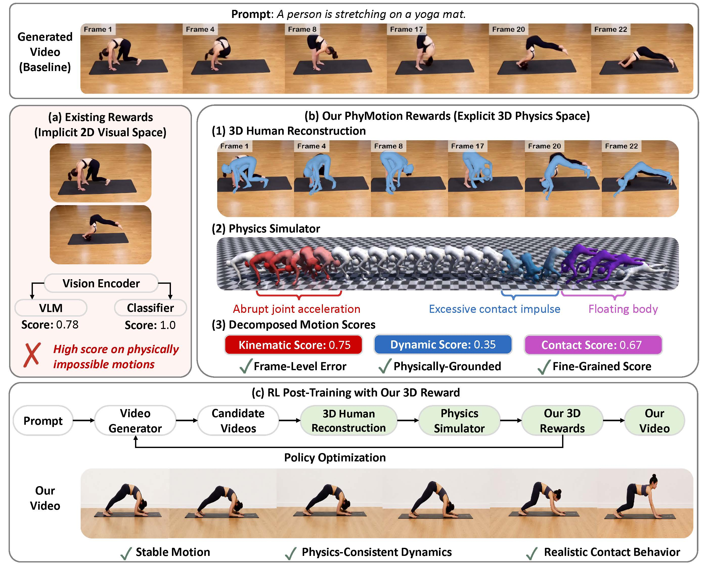

# PhyMotion: Structured 3D Motion Reward for Physics-Grounded Human Video Generation

* Authors: [Yidong Huang](https://owenh-unc.github.io/)\*, [Zun Wang](https://zunwang1.github.io/)\*, [Han Lin](https://hl-hanlin.github.io/), [Dong-Ki Kim](https://dkkim93.github.io/), [Shayegan Omidshafiei](https://www.linkedin.com/in/shayegan/), [Jaehong Yoon](https://jaehong31.github.io/), [Jaemin Cho](https://j-min.io/), [Yue Zhang](https://zhangyuejoslin.github.io/) and [Mohit Bansal](https://www.cs.unc.edu/~mbansal/) (UNC Chapel Hill, FieldAI, NTU Singapore, AI2, Johns Hopkins University)

\* Equal contribution.

* [Project page](https://phy-motion.github.io) · [Arxiv](#) · [Code](https://github.com/h6kplus/PhyMotion)

Generating realistic human motion is a central yet unsolved challenge in video generation. While reinforcement learning (RL)-based post-training has driven recent gains in general video quality, extending it to human motion remains bottlenecked by a reward signal that cannot reliably score motion realism. Existing video rewards primarily rely on 2D perceptual signals, without explicitly modeling the 3D body state, contact, and dynamics underlying articulated human motion, and often assign high scores to videos with floating bodies or physically implausible movements. To address this, we propose PhyMotion, a structured, fine-grained motion reward that grounds recovered 3D human trajectories in a physics simulator and evaluates motion quality along multiple dimensions of physical feasibility. Concretely, we recover SMPL body meshes from generated videos, retarget them onto a humanoid in the MuJoCo physics simulator, and evaluate the resulting motion along three axes: kinematic plausibility, contact and balance consistency, and dynamic feasibility. Each component provides a continuous and interpretable signal tied to a specific aspect of motion quality, allowing the reward to capture which aspects of motion are physically correct or violated. Experiments show that PhyMotion achieves stronger correlation with human judgments than existing reward formulations. These gains carry over to RL-based post-training, where optimizing PhyMotion leads to larger and more consistent improvements than optimizing existing rewards, improving motion realism across both autoregressive and bidirectional video generators under both automatic metrics and blind human evaluation (+68 Elo gain). Ablations show that the three axes provide complementary supervision signals, while the reward preserves overall video generation quality with only modest training overhead.

<p align="center">

</p>


## Pretrained Checkpoints and Data

| Asset | Hugging Face | Notes |
|---|---|---|
| **PhyMotion-CausalForcing-1.3B** LoRA (step 210) | [`6kplus/PhyMotion-CausalForcing-1.3B`](https://huggingface.co/6kplus/PhyMotion-CausalForcing-1.3B) (model) | LoRA adapter for the Causal Forcing 1.3B base, post-trained with the PhyMotion reward. |
| **MotionX prompts** (train 21,348 / test 1,123) | [`6kplus/PhyMotion-MotionX-Prompts`](https://huggingface.co/datasets/6kplus/PhyMotion-MotionX-Prompts) (dataset) | `train.txt` is used for RL rollout during post-training; `test.txt` is used for evaluation. |

Download both:

```
# LoRA adapter
huggingface-cli download 6kplus/PhyMotion-CausalForcing-1.3B \
  --local-dir checkpoints/phymotion-s210

# Train + test prompt splits
huggingface-cli download 6kplus/PhyMotion-MotionX-Prompts \
  --repo-type dataset --local-dir dataset/motionx
```


## Environment Setup

1. Create the Python environment and install dependencies. `requirements.txt` covers the full stack including MuJoCo 3.3.6 and SMPL-X — no separate steps needed.

```
conda create -n phymotion python=3.10 -y
conda activate phymotion
pip install torch==2.6.0 torchvision==0.21.0 --index-url https://download.pytorch.org/whl/cu124
pip install -r requirements.txt
pip install flash-attn==2.7.4.post1 --no-build-isolation
```

> **Troubleshooting `flash-attn`.** Some clusters have `~/.cache` on a different
> filesystem from `$TMPDIR`, which makes `pip install flash-attn` fail with
> `[Errno 18] Invalid cross-device link` when it tries to copy the prebuilt
> wheel into the cache. If that happens, either set `TMPDIR` to the same
> filesystem as `~/.cache`, **or** download and install the wheel directly:
>
> ```
> wget https://github.com/Dao-AILab/flash-attention/releases/download/v2.7.4.post1/flash_attn-2.7.4.post1+cu12torch2.6cxx11abiFALSE-cp310-cp310-linux_x86_64.whl
> pip install flash_attn-2.7.4.post1+cu12torch2.6cxx11abiFALSE-cp310-cp310-linux_x86_64.whl --no-build-isolation
> ```

Quick sanity check the env:

```
python -c "import torch, flash_attn, mujoco, smplx; \
print(f'torch={torch.__version__} cuda={torch.cuda.is_available()}, flash_attn={flash_attn.__version__}, mujoco={mujoco.__version__}')"
# Expected output:
# torch=2.6.0+cu124 cuda=True, flash_attn=2.7.4.post1, mujoco=3.3.6
```

2. Install GVHMR. The reward calls GVHMR in-process to recover SMPL-X meshes from generated frames.

```
git clone https://github.com/zju3dv/GVHMR.git ~/GVHMR
# Follow GVHMR's README to download inputs/checkpoints/ (~9 GB). GVHMR ships
# its own SMPL-X body model files inside that checkpoint bundle, so installing
# GVHMR is sufficient — no separate SMPL-X download is required for PhyMotion.
export GVHMR_ROOT=~/GVHMR
```

The training script and the reward module read `GVHMR_ROOT` from the environment.

The humanoid MJCF model used to retarget SMPL is bundled inside this repo
(`astrolabe/scorers/video/`), so no additional asset is required.

3. Download the base video generator. We train on top of Causal Forcing 1.3B (the autoregressive distilled version of Wan2.1 T2V-1.3B).

```
mkdir -p checkpoints/casualforcing/chunkwise
# The base checkpoint and inference code are released by the Causal Forcing authors;
# see https://github.com/SHI-Labs/Causal-Forcing for the latest download link.
# Place the resulting causal_forcing.pt at:
#   checkpoints/casualforcing/chunkwise/causal_forcing.pt
```

4. (Optional) Download our pretrained PhyMotion-CausalForcing-1.3B LoRA + the MotionX prompt splits from Hugging Face:

```
# LoRA adapter (700 MB)
huggingface-cli download 6kplus/PhyMotion-CausalForcing-1.3B \
  --local-dir checkpoints/phymotion-s210

# Prompt splits: train.txt (21,348) and test.txt (1,123)
huggingface-cli download 6kplus/PhyMotion-MotionX-Prompts \
  --repo-type dataset --local-dir dataset/motionx
```

To train on your own prompt list instead, drop your one-prompt-per-line files at
`dataset/motionx/train.txt` and `dataset/motionx/test.txt`.


## Hardware and Reference Runtimes

Our reported numbers were produced on:

* **Hardware**: 1 node with 8× NVIDIA A100 80 GB, ~256 GB host RAM, fast local NVMe.
* **OS**: Ubuntu 22.04 (Linux 6.8 kernel).
* **CUDA**: 12.4; **Python**: 3.10; **PyTorch**: 2.6.0; **flash-attn**: 2.7.4.post1.

Approximate per-stage compute / wall-clock:

| Stage | Hardware | Wall clock |
|---|---|---|
| Stage 2 (RL post-training) | 8× A100 80 GB | ~12 hours for 210 steps (≈ 3.5 min/step at batch 8) |
| Stage 3 (inference, 45 frames @ 480×832) | 1× A100 / RTX 4090 | ~5 seconds per video |
| Stage 1 (reward, 1 video) | 1× A100 (GVHMR + MuJoCo) | ~3 seconds per video |

The reward dominates training time: each RL step does 8 video rollouts (~40 s of generation) and
8 reward calls (~25 s combined GVHMR + physics), so the reward is roughly 40 % of the per-step
wall clock.


## Stage 1: PhyMotion Reward

The reward grounds each generated video in a 3D body and scores it along three feasibility axes (kinematic, contact, dynamic). It is implemented as a single function in `astrolabe/rewards.py`.

| Axis | Sub-scores |
|---|---|
| **Kinematic** | joint velocity, joint acceleration, self-penetration |
| **Contact**   | foot slip, ground penetration, foot float, balance |
| **Dynamic**   | joint torque, ground reaction force, metabolic effort |

The final reward is the mean of the three axes. All feasibility code (joint-based kinematics and MuJoCo-based contact / dynamics) lives in a single file: `astrolabe/scorers/video/smpl_feasibility.py`.

To wire the reward into a config:

```
config.reward_fn = {"phymotion_score": 1.0}
```

To combine with a perceptual reward (e.g. HPSv3) for balanced training:

```
config.reward_fn = {
    "phymotion_score":   1.0,
    "video_hpsv3_local": 1.0,
}
```


## Stage 2: RL Post-Training

Launch RL post-training of Causal Forcing 1.3B with the PhyMotion reward.

```
export GVHMR_ROOT=/path/to/GVHMR
torchrun --nproc_per_node=8 scripts/train_nft_wan.py \
  --config configs/nft_casual_forcing.py:casual_forcing_video_phymotion
```

* `nproc_per_node`: number of GPUs on a single node.

* `--config`: a `<file>:<entry>` selector. The entry `casual_forcing_video_phymotion` uses the PhyMotion reward (see `configs/nft_casual_forcing.py` for other entries that mix in perceptual rewards).

Outputs are written to `logs/nft/<base_model>/<run_name>_<timestamp>/`:

* `checkpoints/checkpoint-<step>/lora/` — PEFT LoRA adapter (rank 256 on `CausalWanAttentionBlock`).

* `optimizer.pt`, `scaler.pt`, and W&B / TensorBoard logs.


## Stage 3: Inference

Roll out a trained LoRA on a list of prompts.

```
# Using the released PhyMotion-CausalForcing-1.3B LoRA (step 210)
torchrun --nproc_per_node=1 scripts/inference_wan.py \
  --base_model checkpoints/casualforcing/chunkwise/causal_forcing.pt \
  --lora_path  checkpoints/phymotion-s210 \
  --prompt_file prompts/sample.txt \
  --output_dir outputs/test \
  --num_frames 45 --height 480 --width 832 \
  --guidance_scale 3.0 \
  --denoising_steps "1000,750,500,250" \
  --num_frame_per_block 3 \
  --mixed_precision bf16 --seed 42
```

To use your own freshly trained LoRA, point `--lora_path` at your checkpoint dir:

```
--lora_path  logs/nft/wan_casual_chunk/casual_forcing_video_phymotion_<TS>/checkpoints/checkpoint-210
```

* `--base_model`: path to the Causal Forcing 1.3B checkpoint.

* `--lora_path`: a `checkpoint-<step>/` folder or its `lora/` subdir.

* `--prompt_file`: a one-prompt-per-line text file.

* `--output_dir`: directory for the generated mp4s. Expect ~5 seconds per video on a single A100.


## Citation

If you find this work useful, please consider citing:

```bibtex
@article{huang2026phymotion,
  title   = {PhyMotion: Structured 3D Motion Reward for Physics-Grounded Human Video Generation},
  author  = {Huang, Yidong and Wang, Zun and Lin, Han and Kim, Dong-Ki and
             Omidshafiei, Shayegan and Yoon, Jaehong and Cho, Jaemin and
             Zhang, Yue and Bansal, Mohit},
  journal = {arXiv preprint},
  year    = {2026}
}
```


## License

Code is released under the MIT license. The base models, GVHMR, and MotionX prompts retain their own licenses; see their respective repositories for details.
